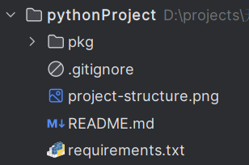

sphinx私房手册
=========================

使用sphinx生成文档的基本套路是：

1. 安装sphinx
2. 使用sphinx生成文档框架
3. 进行自定义修改
4. 上传到 `RTD <https://readthedocs.org/dashboard/>`_ (或者上传到github，登陆RTD，关联github)
5. 构建生成在线文档

快速开始
-------------------

- `快速入门 <https://www.osgeo.cn/sphinx/tutorial/getting-started.html#setting-up-your-project-and-development-environment>`_

通常情况下，我们创建一个项目以后，项目结构大致是这样的：

然后，进入项目根目录，运行：

.. code-block:: console

    sphinx-quickstart docs

回答一堆问题以后，会自动生成各种文件，项目结构变成了这样：

官方文档中，直接开始介绍reStructuredText语法，中间缺少一个对生成文档结构的介绍，这会让人觉得有点懵，起码
我当时在这里卡住了，学了一堆reStructuredText语法，感觉好像还是不知道从哪里下手。这就好像还不清楚房子的整
体结构，直接就开始搬砖，因此，我们首先看看生成的文档结构是怎样的：

文档结构
-------------------

文档结构如下

--------------------------------------------

常用配置
-------------------

sphinx的配置官方文档如下：

- `configuration <https://www.sphinx-doc.org/en/master/usage/configuration.html>`_

html_sidebars
~~~~~~~~~~~~~~~~~~~~~

rst_prolog
~~~~~~~~~~~~~~~~~~~~~

这个配置的内容会在每个rst文件最开始的时候执行。比如，我需要内联高亮python语言，则可以在conf文件里面配置 ``rst_prolog`` :

.. code-block:: rst

    rst_prolog = """
    .. role:: py(code)
       :language: python
    """

这样，就不需要在每个rst文件里面定义 ``py`` 角色了，相当于定义了一个全局的 ``py`` 角色。

default_role
~~~~~~~~~~~~~~~~~~~~~~~

设置默认的角色，默认为 :py:`None`, 在sphinx_rtd_theme的主题中，渲染的结果是斜体。设置的语法如下，角色名之间用双引号包含即可：

.. code-block:: rst

    default_role = "any"

:ref:`tutorials/rst:any` 是一个角色，它比较适合被设置成默认角色。

--------------------------------------------

常用插件
--------------------

sphinx.ext.napoleon
~~~~~~~~~~~~~~~~~~~~~~

reStructuredText写docstrings看起来有点混乱，除了直接用reStructuredText写docstrings，常见的还有google风格和numpy风格。
这两种风格比较起来更简洁和清爽。比如，著名的pandas使用的就是numpy风格的docstrings。

napoleon是一个预处理器，它可以把google或者numpy风格的docstrings转换成reStructuredText,

- `sphinx.ext.napoleon <https://www.sphinx-doc.org/en/master/usage/extensions/napoleon.html>`_
- `google风格的例子 <https://www.sphinx-doc.org/en/master/usage/extensions/example_google.html>`_
- `numpy风格的例子 <https://www.sphinx-doc.org/en/master/usage/extensions/example_numpy.html#example-numpy>`_

如果使用pycharm，可以在设置->工具->python集成工具->docstrings中，选择自动生成相应的风格。

sphinx.ext.intersphinx
~~~~~~~~~~~~~~~~~~~~~~~~~~

sphinx.ext.autosectionlabel
~~~~~~~~~~~~~~~~~~~~~~~~~~~~~~~

该插件可以自动给章节标题，脚注等添加target标签
