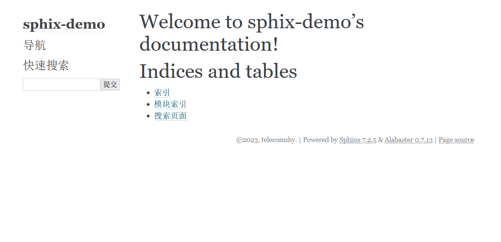

sphinx私房手册
=========================

使用sphinx生成文档的基本套路是：

1. 安装sphinx
2. 使用sphinx生成文档框架
3. 进行自定义修改
4. 上传到 `RTD <https://readthedocs.org/dashboard/>`_ (或者上传到github，登陆RTD，关联github)
5. 构建生成在线文档

sphinx使用方法
-------------------

基本套路
~~~~~~~~~~~~~

.. seealso::

    `官方文档-快速入门（中文） <https://www.osgeo.cn/sphinx/tutorial/getting-started.html#setting-up-your-project-and-development-environment>`_

通常情况下，我们创建一个项目以后，项目结构大致是这样的：

.. image:: ../imgs/project1.png

接下来，安装sphinx，然后进入项目根目录，运行：

.. code-block:: console

    sphinx-quickstart docs

此时需要回答一些问题，比如作者，版本什么的，唯一要注意的是，语言如果选择中文的话，应输入 ``zh_CN`` 。

回答完问题以后，会自动生成一些文件，项目结构变成了这样：

.. image:: ../imgs/project2.png

生成了一个docs文件夹，其文件结构如下：

:source文件夹: 配置文件和需要修改编写的rst文件都放在这里

    :conf.py: 配置文件
    :index.rst: 入口文件，你可以理解成网页的首页

:build文件夹: 自动生成的html网页都在这里，现在还是空的

:make.bat: 工具文件，生成html就靠它了

进入docs文件夹，运行：

.. code-block:: console

    sphinx-build -b html docs/source/ docs/build/html

这个命令就是编译source文件夹的rst文件，生成的页面放在 ``docs/build/html`` 文件下。

此时build目录下生成了一个html文件夹，里面生成很多文件，其中index.html文件和source文件夹下的index.rst
是对应的，接下来要做的就是修改index.rst，编写与之关联的其它rst文件，然后在docs目录下运行：

.. code-block:: shell

    make html

就会生成修改后的html文件，然后不断的重复这个过程，最终完成文档编写。

官方文档到这里，入门基本就完了。接着就开始介绍reStructuredText语法，让人觉得有点懵，起码我当时在这里卡了
不少时间。这就好像还不清楚房子的整体结构，直接就开始搬砖造房子。因此，我们首先研究一下rst文件和html文件是
怎么关联起来的。

rst文件基本结构
~~~~~~~~~~~~~~~~~

最初生成的html如图：

对应的rst文件如图：

.. image:: ../imgs/project4.png
    :width: 400

隐约可以看到两者之间的对应关系，最下面的 ``Indices and tables`` 部分暂时不管，这是sphinx自动生成的。
主要看 ``toctree`` 这部分奇怪的内容。这其实是一个reStructuredText指令，所谓指令，暂时不懂没关系，后
面进一步学习 :doc:`rst` 就明白了，暂时你只要知道，遇到这种两个 ``.`` 开头的标记，意味这接下来的内容需要
进行特殊的解读：

.. code-block:: rst

    .. toctree::
       :maxdepth: 2
       :caption: Contents:

可以说，理解了这个 ``toctree`` 指令，sphinx就掌握了一大半，接下来的学习就基本没什么难度。这个指令的意思
是，抽取指令列举的文档的所有章节的标题形成一个目录。

现在这个指令并没有列举任何文档，所以显示是空白。接下来，在docs目录下分别创建demo1.rst, demo2.rst两个
文件，demo1.rst文件内容如下::

    Demo1 Content
    =================

    demo1 section1
    -----------------

    demo1 section1 content

    demo1 section2
    -----------------

    demo1 section2 content

demo2.rst文件内容如下::

    Demo2 Content
    =================

    demo2 section1
    -----------------

    demo2 section1 content

    demo2 section2
    -----------------

    demo2 section2 content

现在修改index.rst的toctree部分，修改成如下形式::

    .. toctree::
       :maxdepth: 2
       :caption: Contents:

       demo1
       demo2

接下来，在docs目录下运行 ``make html`` , 再次打开index.html页面，可以看到页面发生了变化：

.. image:: ../imgs/project5.png

操作到这里，相信已经基本上了解了toctree指令的作用：它抽取列举文档的所有章节标题，形成目录，该目录会同时
呈现在主页面和侧边栏中。index.rst必须有一个根toctree指令，否则编译的时候会提示错误。

为了简洁，这里不深入讨论toctree指令，可以查看 :ref:`tutorials/rst:toctree` 查看其细节及注意事项。

index.rst是一个入口文件，它应该是整个项目各部分内容的介绍，每一部分是一个或多个rst文件。通过toctree
形成目录把所有文件关联起来。

自动生成API文档
~~~~~~~~~~~~~~~~~~

到这里基本上对sphix的基本使用方法，整体结构已经了解的差不多了，还剩下最后一部分内容。就是如何自动抽取代码
中的docstring，形成API文档。

到这里，相信已经对如何使用sphinx有了一个全面的了解。接下来就是熟悉sphinx的常用配置和插件，以及深入学习
:doc:`reStructuredText<rst>` 语法。

--------------------------------------------

常用配置
-------------------

.. seealso::

    `官方文档 <https://www.sphinx-doc.org/en/master/usage/configuration.html>`_

html_sidebars
~~~~~~~~~~~~~~~~~~~~~

rst_prolog
~~~~~~~~~~~~~~~~~~~~~

这个配置的内容会在每个rst文件最开始的时候执行。比如，我需要内联高亮python语言，则可以在conf文件里面配置 ``rst_prolog`` :

.. code-block:: rst

    rst_prolog = """
    .. role:: py(code)
       :language: python
    """

这样，就不需要在每个rst文件里面定义 ``py`` 角色了，相当于定义了一个全局的 ``py`` 角色。

default_role
~~~~~~~~~~~~~~~~~~~~~~~

设置默认的角色，默认为 :py:`None`, 在sphinx_rtd_theme的主题中，渲染的结果是斜体。设置的语法如下，角色名之间用双引号包含即可：

.. code-block:: rst

    default_role = "any"

:ref:`tutorials/rst:any` 是一个角色，它比较适合被设置成默认角色。

--------------------------------------------

常用插件
--------------------

sphinx.ext.napoleon
~~~~~~~~~~~~~~~~~~~~~~

.. seealso::

    - `sphinx.ext.napoleon <https://www.sphinx-doc.org/en/master/usage/extensions/napoleon.html>`_
    - `google风格的例子 <https://www.sphinx-doc.org/en/master/usage/extensions/example_google.html>`_
    - `numpy风格的例子 <https://www.sphinx-doc.org/en/master/usage/extensions/example_numpy.html#example-numpy>`_

reStructuredText写docstrings看起来有点混乱，除了直接用reStructuredText写docstrings，常见的还有google风格和numpy风格。
这两种风格比较起来更简洁和清爽。比如，著名的pandas使用的就是numpy风格的docstrings。

napoleon是一个预处理器，它可以把google或者numpy风格的docstrings转换成reStructuredText,

如果使用pycharm，可以在设置->工具->python集成工具->docstrings中，选择自动生成相应的风格。

sphinx.ext.intersphinx
~~~~~~~~~~~~~~~~~~~~~~~~~~

sphinx.ext.autosectionlabel
~~~~~~~~~~~~~~~~~~~~~~~~~~~~~~~

该插件可以自动给章节标题，脚注等添加target标签
