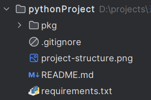
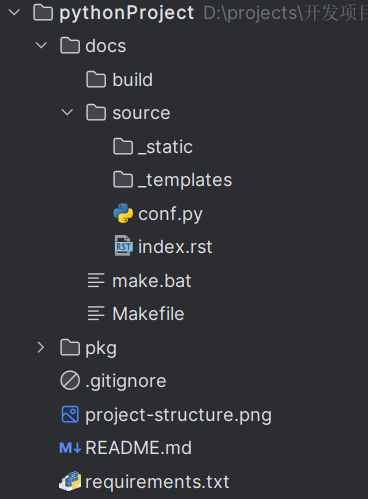
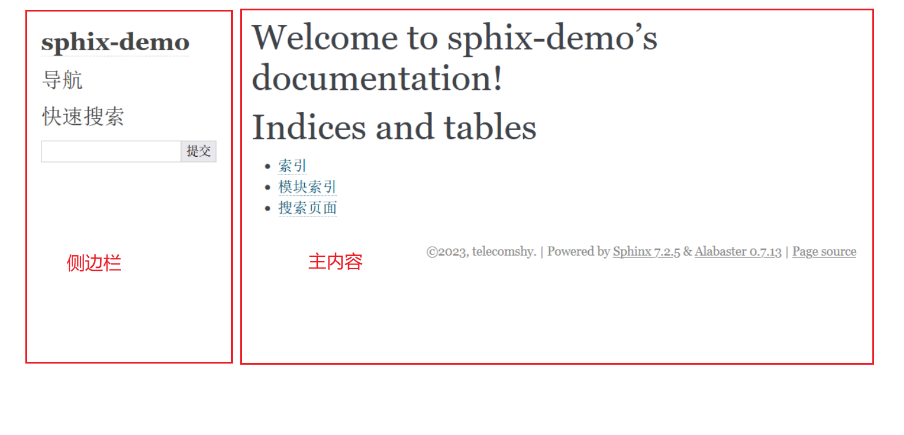
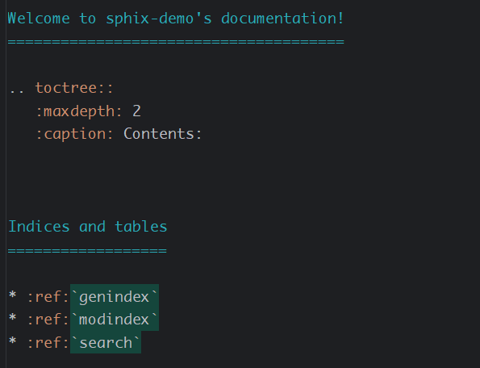
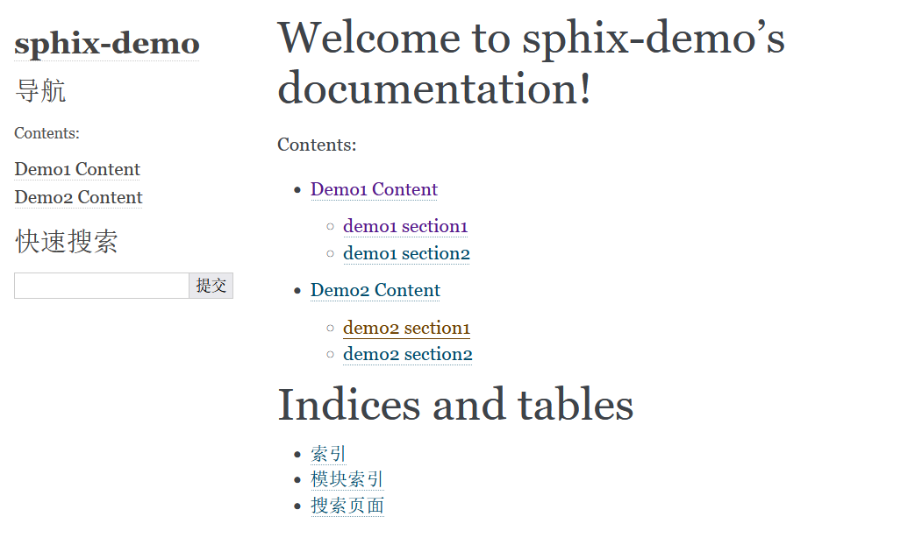
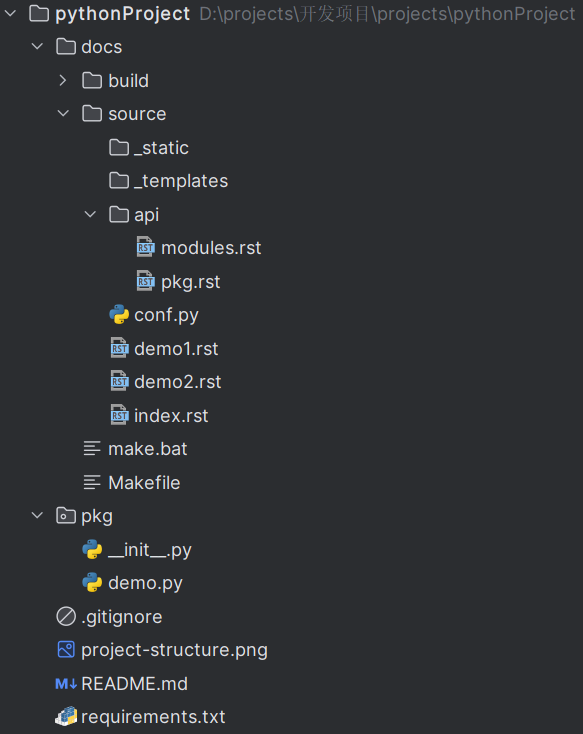
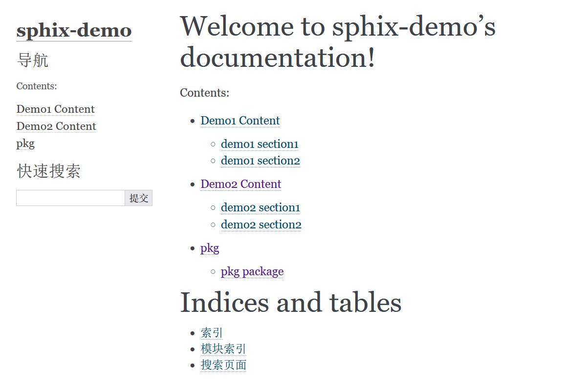
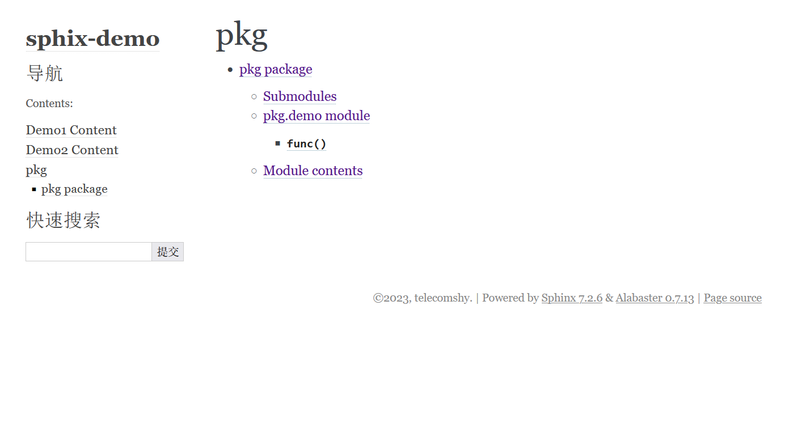
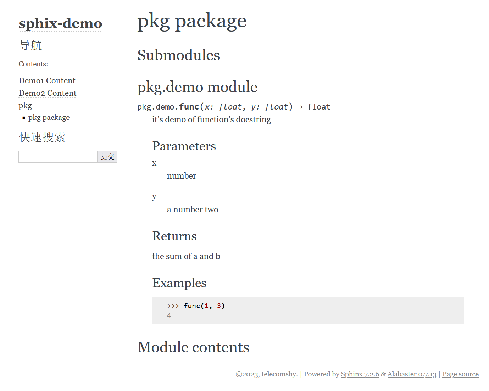

sphinx私房手册
=========================

使用sphinx生成文档的基本套路是：

1. 安装sphinx
2. 使用sphinx生成文档框架
3. 进行自定义修改
4. 上传到 `RTD <https://readthedocs.org/dashboard/>`_ (或者上传到github，登陆RTD，关联github)
5. 构建生成在线文档

sphinx使用方法
-------------------

基本套路
~~~~~~~~~~~~~

.. seealso::

    `官方文档-快速入门（中文） <https://www.osgeo.cn/sphinx/tutorial/getting-started.html#setting-up-your-project-and-development-environment>`_

通常情况下，我们创建一个项目以后，项目结构大致是这样的：

接下来，安装sphinx，然后进入项目根目录，运行：

.. code-block:: console

    sphinx-quickstart docs

此时需要回答一些问题，比如作者，版本什么的，唯一要注意的是，语言如果选择中文的话，应输入 ``zh_CN`` 。

回答完问题以后，会自动生成一些文件，项目结构变成了这样：

生成了一个docs文件夹，其文件结构如下：

:source文件夹: 配置文件和需要修改编写的rst文件都放在这里

    :conf.py: 配置文件
    :index.rst: 入口文件，你可以理解成网页的首页

:build文件夹: 自动生成的html网页都在这里，现在还是空的

:make.bat: 工具文件，生成html就靠它了

进入docs文件夹，运行：

.. code-block:: console

    sphinx-build -b html docs/source/ docs/build/html

这个命令就是编译source文件夹的rst文件，生成的页面放在 ``docs/build/html`` 文件下。

此时build目录下生成了一个html文件夹，里面生成很多文件，其中index.html文件和source文件夹下的index.rst
是对应的，接下来要做的就是修改index.rst，编写与之关联的其它rst文件，然后在docs目录下运行：

.. code-block:: shell

    make html

就会生成修改后的html文件，然后不断的重复这个过程，最终完成文档编写。

官方文档到这里，入门基本就完了。接着就开始介绍reStructuredText语法，让人觉得有点懵，起码我当时在这里卡了
不少时间。这就好像还不清楚房子的整体结构，直接就开始搬砖造房子。因此，我们首先研究一下rst文件和html文件是
怎么关联起来的。

rst文件基本结构
~~~~~~~~~~~~~~~~~

最初生成的html如图，如果严格按照上面的操作步骤的话，该文件为 ``docs/build/index.html`` ，和 ``docs/source/index.rst`` 对应：

对应的 ``index.rst`` 文件内容如图：

乍一看会有点懵，我们来一步一步拆解。首先，整个页面可以分为主内容和侧边栏，侧边栏目前不用管，它的内容是根据 :rst:`toctree` 指令
自动生成的（ ``toctree`` 指令解释在后面）。

再来看主内容部分，我们在 ``index.rst`` 文件中编写的内容和主内容部分是一一对应的。最下面的 ``Indices and tables`` 部分暂时
也不用管，这部分也是sphinx自动生成的。主要看 ``toctree`` 这部分奇怪的内容。这其实是一个reStructuredText指令，所谓指令，暂时
不懂没关系，后面进一步学习 :doc:`rst` 就明白了，现在你只要知道，遇到这种两个 ``.`` 开头的标记，意味这接下来的内容需要进行特殊的解读：

.. code-block:: rst

    .. toctree::
       :maxdepth: 2
       :caption: Contents:

可以说，理解了这个 ``toctree`` 指令，sphinx就掌握了一大半，接下来的学习就基本没什么难度。这个指令的意思
是，抽取指令列举的文档的所有章节的标题形成一个目录。

现在这个指令并没有列举任何文档，所以显示是空白。接下来，在docs目录下分别创建demo1.rst, demo2.rst两个
文件，demo1.rst文件内容如下::

    Demo1 Content
    =================

    demo1 section1
    -----------------

    demo1 section1 content

    demo1 section2
    -----------------

    demo1 section2 content

demo2.rst文件内容如下::

    Demo2 Content
    =================

    demo2 section1
    -----------------

    demo2 section1 content

    demo2 section2
    -----------------

    demo2 section2 content

现在修改index.rst的toctree部分，修改成如下形式::

    .. toctree::
       :maxdepth: 2
       :caption: Contents:

       demo1
       demo2

接下来，在docs目录下运行 ``make html`` , 再次打开index.html页面，可以看到页面发生了变化：

操作到这里，相信已经基本上了解了toctree指令的作用：它抽取列举文档的所有章节标题，形成目录，该目录会同时
呈现在主页面和侧边栏中。index.rst必须有一个根toctree指令，否则编译的时候会提示错误。

为了简洁，这里不深入讨论toctree指令，可以查看 :ref:`tutorials/rst:toctree` 查看其细节及注意事项。

index.rst是一个入口文件，它应该是整个项目各部分内容的介绍，每一部分是一个或多个rst文件。通过toctree
形成目录把所有文件关联起来。

到这里基本上对sphinx的基本使用方法，整体结构已经了解的差不多了，接下来就是编写rst文件，编译成html文件，不断
重复这个过程。不过，如果是为软件包编写文档，那么还剩下一部分内容需要了解。就是如何自动抽取代码中的docstring，
形成API文档。

自动生成API文档
~~~~~~~~~~~~~~~~~~

一个完整的文档，一般包含教程和软件包API文档两大块内容，其中api的部分，sphinx提供了便捷的方法，只需要通过简单的指令，
就能自动抽取代码中的docstrings，形成完成的API文档。

首先，我们在写代码的时候，不光要写注释，要按照规范的格式编写docstrings。 所谓docstrings，也是注释
的一种，不过普通的注释是给程序员自己看的，而docstrings是给使用包的其它人看的。

关于docstrings，我们这里不详细展开。需要了解的是，sphinx支持用三种不同的风格书写docstrings，
分别是reStructuredText, google和numpy风格。

比如：当我们写一个函数的docstring，原生的reStructuredText是这样：

.. code-block:: python

    def function_with_types_in_docstring(param1, param2)::
        """Example function with types documented in the docstring.

        :pep:`484` type annotations are supported. If attribute, parameter, and
        return types are annotated according to `PEP 484`_, they do not need to be
        included in the docstring:

        :param param1: The first parameter
        :type param1: int
        :param param2: The second parameter
        :type param2: str
        :returns: The return value. True for success, False otherwise.
        :rtype: bool
        """

如果是google风格，则应该写成这样：

.. code-block:: python

    def function_with_types_in_docstring(param1, param2):
        """Example function with types documented in the docstring.

        :pep:`484` type annotations are supported. If attribute, parameter, and
        return types are annotated according to `PEP 484`_, they do not need to be
        included in the docstring:

        Args:
            param1 (int): The first parameter.
            param2 (str): The second parameter.

        Returns:
            bool: The return value. True for success, False otherwise.
        """

numpy风格呢，则是下面这样：

.. code-block:: python

    def function_with_types_in_docstring(param1, param2):
        """Example function with types documented in the docstring.

        :pep:`484` type annotations are supported. If attribute, parameter, and
        return types are annotated according to `PEP 484`_, they do not need to be
        included in the docstring:

        Parameters
        ----------
        param1 : int
            The first parameter.
        param2 : str
            The second parameter.

        Returns
        -------
        bool
            True if successful, False otherwise.
        """

.. attention::

    这三种风格，只是参数，返回值等一些细节方面有所不同，其它的内容仍然遵循reStructuredText语法。

可见，原生的reStructuredText写法比较麻烦，可读性也不如google或者numpy的风格，所以推荐使用后两种。其中，google风格横向比较长，
相对紧凑一点，pydantic使用的就是google风格，而numpy纵向比较长，比较适合长篇幅的内容，pandas使用的就是numpy风格。具体选用哪一
种，完全取决于个人审美。

这两种风格的具体写法，参考官方文档：

.. seealso::

    - `google风格的例子 <https://www.sphinx-doc.org/en/master/usage/extensions/example_google.html>`_
    - `numpy风格的例子 <https://www.sphinx-doc.org/en/master/usage/extensions/example_numpy.html#example-numpy>`_

如果使用pycharm，可以在设置->工具->python集成工具->docstrings中，选择自动生成相应的风格。

了解了关于docstrings的基本概念，接下来要做的，就是使用sphinx提供的工具，自动抽取docstrings，形成API文档。这一步非常简单，但是
在此之前，我们还需要先了解 ``autodoc`` 插件。

正常情况下，我们如果在rst文件中，手写一个函数的说明文档，需要这样写：

.. code-block:: rst

    .. py:function:: send_message(sender, recipient, message_body, [priority=1])

       Send a message to a recipient

       :param str sender: The person sending the message
       :param str recipient: The recipient of the message
       :param str message_body: The body of the message
       :param priority: The priority of the message, can be a number 1-5
       :type priority: integer or None
       :return: the message id
       :rtype: int
       :raises ValueError: if the message_body exceeds 160 characters
       :raises TypeError: if the message_body is not a basestring

但是我们在写代码的时候，已经编写了这个函数的docstrings，在写rst文件的时候，就不用再重复写函数的说明文档了。修改conf.py
的extensions部分如下：

.. code-block:: python

    extensions = [
        'sphinx.ext.autodoc',
    ]

然后，在rst文件中，把 :rst:`.. py:function::` 部分改为(假设 ``send_message`` 是模块 ``demo`` 的顶层函数)：

.. code-block:: rst

    .. autofunction:: send_message

编译的时候，就会自动抽取 ``send_message`` 函数中的docstrings，效果和使用 :rst:`.. py:function::` 指令手写是一样的。

除了 ``autofunction`` ，autodoc还提供了 ``autoclass`` , ``automodule`` 等指令，用来抽取类，模块等的docstrings。

其实到了这一步，我们已经可以通过autodoc来手动编写api文档，但是sphinx提供了一个工具，帮助大家自动完成这一步。只需要在命令行运行：

.. code-block:: console

    sphinx-apidoc [OPTIONS] -o <OUTPUT_PATH> <MODULE_PATH> [EXCLUDE_PATTERN …]

比如，还是之前的demo项目，退回到项目根目录，运行：

.. code-block:: console

    sphinx-apidoc -o docs/source/api pkg

此时在 ``/docs/source/api`` 目录下，生成了一个modules.rst文件和pkg.rst文件：

其中modules.rst仅包含一个 ``toctree`` 指令，如果前面的内容还记得的话，就知道它是抽取其它文件的章节标题形成目录。而pkg.rst
则是利用autodoc抽取代码中docstrings，形成api文档。

然后修改index.rst的 ``toctree`` 指令，添加modules文件:

.. code-block:: rst

    .. toctree::
       :maxdepth: 2
       :caption: Contents:

       demo1
       demo2
       api/modules

.. attention::

    如果pkg目录下没有__init__文件，则sphinx-apidoc需要加--implicit-namespaces选项

然后 ``make html`` 重新编译。index页面现在变成：

点击pkg，该页面对应modules.rst文件，生成的html页面如下：

点击pkg package，该页面对应pkg.rst文件，生成的html页面如下：

接下来做什么
===================

到这里，相信已经对如何使用sphinx有了一个全面基本的了解，可以开始动手了。接下来推荐学习 :ref:`tutorials/rst:reStructuredText私房手册`
的内容，了解reStructuredText的基本语法，特别是 :ref:`tutorials/rst:交叉引用` 部分。再就是熟悉sphinx的各种常用配置和插件。

另外，生成的html文档，如何在 `RTD <https://about.readthedocs.com/>`_ 上部署，也需要了解，不过这部分非常简单，这里就不展开啦。

--------------------------------------------

常用配置
-------------------

.. seealso::

    `官方文档 <https://www.sphinx-doc.org/en/master/usage/configuration.html>`_

html_sidebars
~~~~~~~~~~~~~~~~~~~~~

rst_prolog
~~~~~~~~~~~~~~~~~~~~~

这个配置的内容会在每个rst文件最开始的时候执行。比如，我需要内联高亮python语言，则可以在conf文件里面配置 ``rst_prolog`` :

.. code-block:: rst

    rst_prolog = """
    .. role:: py(code)
       :language: python
    """

这样，就不需要在每个rst文件里面定义 ``py`` 角色了，相当于定义了一个全局的 ``py`` 角色。

default_role
~~~~~~~~~~~~~~~~~~~~~~~

设置默认的角色，默认为 :py:`None`, 在sphinx_rtd_theme的主题中，渲染的结果是斜体。设置的语法如下，角色名之间用双引号包含即可：

.. code-block:: rst

    default_role = "any"

:ref:`tutorials/rst:any` 是一个角色，它比较适合被设置成默认角色。

--------------------------------------------

常用插件
--------------------

sphinx.ext.napoleon
~~~~~~~~~~~~~~~~~~~~~~

.. seealso::

    - `sphinx.ext.napoleon <https://www.sphinx-doc.org/en/master/usage/extensions/napoleon.html>`_

reStructuredText写docstrings看起来有点混乱，除了直接用reStructuredText写docstrings，常见的还有google风格和numpy风格。
这两种风格比较起来更简洁和清爽。比如，著名的pandas使用的就是numpy风格的docstrings。

napoleon是一个预处理器，它可以把google或者numpy风格的docstrings转换成reStructuredText,

sphinx.ext.intersphinx
~~~~~~~~~~~~~~~~~~~~~~~~~~

sphinx.ext.autosectionlabel
~~~~~~~~~~~~~~~~~~~~~~~~~~~~~~~

该插件可以自动给章节标题，脚注等添加target标签
